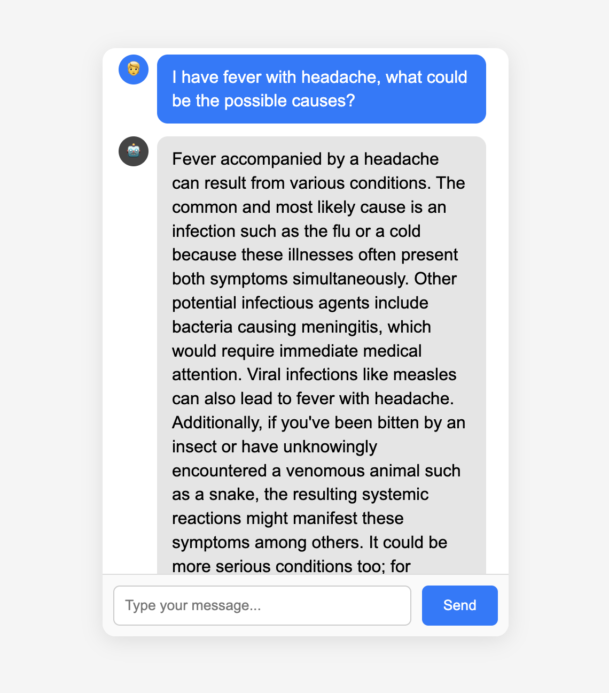
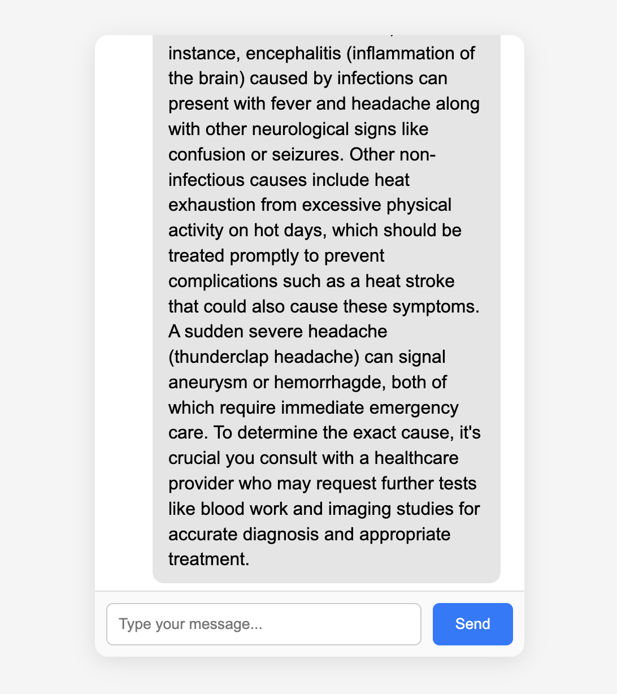

Medical Symptom Chatbot

This is a small web-based chatbot that runs locally using Ollama and the Phi-3 model.
The bot gives general information based on symptoms and helps users understand what kinds of conditions might be related.

It is not a diagnostic tool and doesn’t suggest medicines or treatment.

⸻

Features
	•	Runs completely offline
	•	Simple chat interface (HTML + JS)
	•	Node.js + Express backend
	•	Uses Phi-3 through Ollama
	•	Gives general medical info, not prescriptions
	•	Typing animation + clean UI

⸻

Requirements
	•	Node.js
	•	Ollama installed on your system
	•	Phi-3 model pulled locally:

ollama pull phi3

⸻

How to Run

Start Ollama:

ollama serve

Install dependencies:

npm install

Run the backend:

node server.js

Open index.html in your browser to use the chatbot.

⸻

How It Works

The frontend sends the user’s message to the Express server, which forwards it to Phi-3.
The model returns general information about the symptoms, and the UI displays it.

## Screenshots

### Chat UI

### Typing animation

